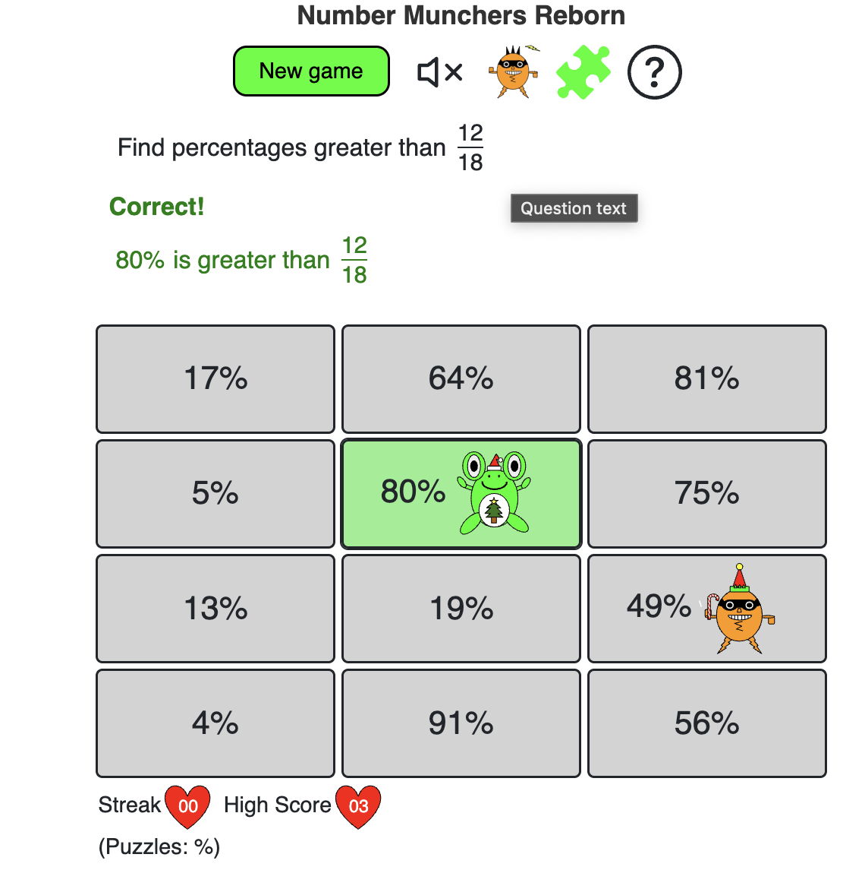

# Number Munchers Reborn

# A number-munchers-like game

Steven Mycynek 2025

This started off as a simple project to do on an airplane, but people liked the [original primitive attempt](https://stevenvictor.net/numbers/), so I took it from
something made with an HTML `<table>` and vanilla JS in two hours to a [more well-supported Angular app](https://stevenvictor.net/number-munchers/) with graphics
and sound.  In the past year, this project has taken off, and children are playing it in schools and at home in the Boston area and beyond!

I don't own the copyright to the original Number Munchers concept -- it's an old [80-90s game](https://www.mecc.co/mac--pc-products/munchers/math-munchers-deluxe.html),
but all the code here is my own, and it's different enough, experience-wise,
that it's fair to put an MIT license on it.

## Setup

- `bun install`
- `ng serve` for a development server.
- `preplocal.sh` or `deploy.sh` to build for production
- `config.sh` to deploy a holiday configuration
- tests: `end2end-tests.sh` and `unit-tests.sh`
- Live demo at https://stevenvictor.net/number-munchers

version: 000457
